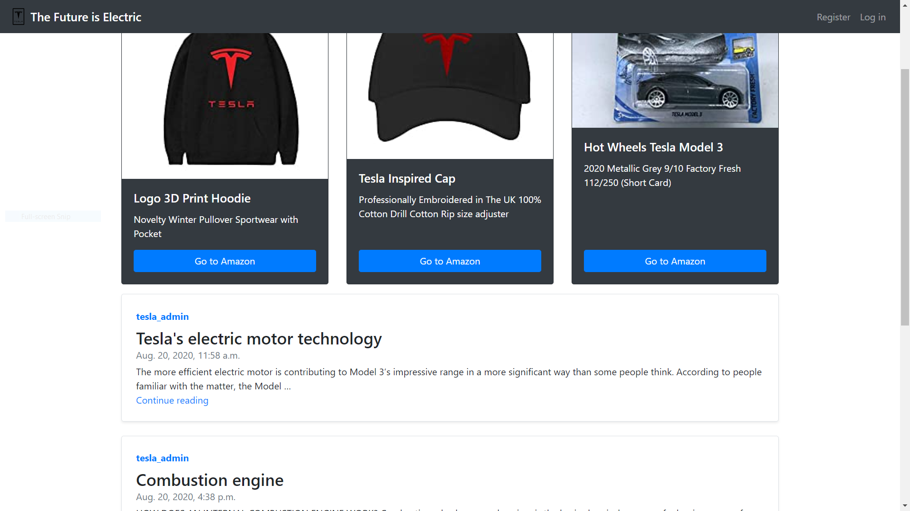

# Tesla Blog

This is going to be a technical blog about Tesla Cars, electric engines and their mechanics.
The Tesla Blog homepage will describe the site and show the latest posts.

# Live Version

To see an online version go to:

[The future is Electric](https://future-is-electric.herokuapp.com/)

# Usage

The user can create account and add posts. The front website shows the links for the merchendise on Amazon.

## Instalation

1. Create virtual env.
2. pip install requirements.txt
3. Remeber to set up a secret key.
4. Migrate the database.
5. Run: python manage.py runserver
6. Go to local host.

## Contributing
Pull requests are welcome. For major changes, please open an issue first to discuss what you would like to change.

Please make sure to update tests as appropriate.

## License
[MIT](https://choosealicense.com/licenses/mit/)